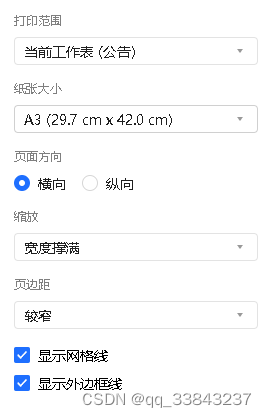
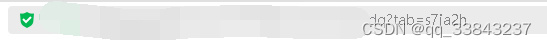
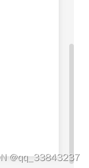

# 腾讯在线文档下载文档html格式（没下载权限也可以，但是图片不能下载）

## 步骤

1.  chrome 浏览器打开该文档（edge不行）
2. 同时按住`ctrl+p`快捷键调出腾讯文档内置的打印页面，**打印范围**要选择`整个工作薄`，**纸张**建议调大一点，**边距**建议较窄，**缩放**要选择`宽度撑满`，不然可能会有内容太宽而显示不出来


3. 可能要等加载打印预览，耐心等待
> 判断是否卡死可以看url的`?tab=xxx`参数是否变化，如果在变则没有卡死
> 

4. 按下`F12`快捷键，用检查模式，找到你要定位的标签（需要观察这个标签是不是滚动屏幕更改了内容）
> 用`ctrl+f`快捷键在元素中查找文本也可以定位到附近，这里需要具体情况具体分析
> 其实在这一步时如果图方便可以点击`下一步`按钮，会导出pdf格式，但是如果文件很大的话，会卡死
5. 获取该标签完整xpath，输入到输入框中
6. 点击`开始监控`按钮，油猴脚本（放在文末）就开始监视你输入的xpath元素的一级子元素变化了，会将没有出现过的子元素追加到该xpath元素元素中
7. 不断向下滑动屏幕（不划动之后的内容不会刷新，也不要太快了，可能程序跟不上），一直滑动到打印预览区域的底部

8. 点击导出内容，下载保存的xpath元素，如果担心不全的话，可以多次上下滑动滚动条，直到导出的文件大小不再变化
9. 可以使用python代码（文末）删除js和css代码，使得界面更清晰

## 油猴脚本
```js
// ==UserScript==
// @name         Monitor and Save Div Content
// @namespace    http://tampermonkey.net/
// @version      1.3
// @description  Monitor a specific div element and save its content, including child elements. Append new content and provide an export button.
// @match        *://*/*
// @grant        none
// ==/UserScript==

(function() {
    'use strict';

    // 存储div内容的数组
    let divContent = [];
    // 存储目标div的XPath
    let targetDivXPath = '';
    // 存储MutationObserver实例
    let observer;
    // 存储目标div元素
    let targetDiv;
    // 存储开始监控的时间
    let startTime = null;
    // 存储导出文件的时间
    let endTime = null;

    // 这里的几个按钮位置很混乱，仍然需要重新排列
    // 创建输入框用于输入XPath
    const inputBox = document.createElement('input');
    inputBox.type = 'text';
    inputBox.placeholder = 'Enter XPath here';
    inputBox.style.position = 'fixed';
    inputBox.style.top = '10px';
    inputBox.style.right = '300px';
    inputBox.style.zIndex = '9999';
    inputBox.addEventListener('keydown', function(event) {
        if (event.key === 'Enter') {
            startMonitoring();
        }
    });
    document.body.appendChild(inputBox);

    // 创建开始按钮
    const startButton = document.createElement('button');
    startButton.textContent = '开始监控';
    startButton.style.position = 'fixed';
    startButton.style.top = '10px';
    startButton.style.right = '350px';
    startButton.style.zIndex = '9999';
    startButton.addEventListener('click', startMonitoring);
    document.body.appendChild(startButton);

    // 创建停止按钮
    const stopButton = document.createElement('button');
    stopButton.textContent = '停止监控';
    stopButton.style.position = 'fixed';
    stopButton.style.top = '10px';
    stopButton.style.right = '400px';
    stopButton.style.zIndex = '9999';
    stopButton.addEventListener('click', stopMonitoring);
    document.body.appendChild(stopButton);

    // 创建导出按钮
    const exportButton = document.createElement('button');
    exportButton.textContent = '导出内容';
    exportButton.style.position = 'fixed';
    exportButton.style.top = '30px'; // Move down to the next line
    exportButton.style.right = '300px';
    exportButton.style.zIndex = '9999';
    exportButton.addEventListener('click', exportContent);
    document.body.appendChild(exportButton);

    function startMonitoring() {
        // 清空divContent数组
        divContent = [];
        targetDivXPath = inputBox.value.trim();
        if (!targetDivXPath) {
            alert('请输入有效的XPath。');
            return;
        }

        // 停止之前的监控，如果存在
        if (observer) {
            stopMonitoring();
        }

        try {
            targetDiv = document.evaluate(targetDivXPath, document, null, XPathResult.FIRST_ORDERED_NODE_TYPE, null).singleNodeValue;
            if (!targetDiv) {
                alert('无法找到目标div元素，请检查XPath是否正确。');
                return;
            }

            // 获取当前时间
            startTime = new Date();

            // 保存当前div的内容
            saveCurrentDivContent(targetDiv);

            observer = new MutationObserver(function(mutations) {
                mutations.forEach(function(mutation) {
                    if (mutation.type === 'childList') {
                        const addedNodes = mutation.addedNodes;
                        for (let i = 0; i < addedNodes.length; i++) {
                            const newContent = addedNodes[i].outerHTML;
                            // 虽然大部分去重了，但是好像仍然有少部分重复
                            if (!divContent.includes(newContent)) {
                                divContent.push(newContent);
                            }
                        }
                    }
                });
            });

            const config = { childList: true, subtree: true };
            observer.observe(targetDiv, config);

            startButton.textContent = '监控中...';
            startButton.disabled = true;
            stopButton.disabled = false; // 启用停止按钮
            inputBox.disabled = true;
        } catch (e) {
            alert('XPath无效或页面未完全加载，请刷新页面后重试。');
        }
    }

    function stopMonitoring() {
        if (observer) {
            observer.disconnect();
            observer = null;
        }
        startButton.textContent = '开始监控';
        startButton.disabled = false;
        stopButton.disabled = true; // 禁用停止按钮
        inputBox.disabled = false;
        alert('监控已停止。');
    }

    function exportContent() {
        if (divContent.length === 0) {
            alert('当前没有内容可以导出。');
            return;
        }

        let startTime2 = startTime.getFullYear() + '-' + (startTime.getMonth() + 1).toString().padStart(2, '0') + '-' + startTime.getDate().toString().padStart(2, '0') + ' ' + startTime.getHours().toString().padStart(2, '0') + ':' + startTime.getMinutes().toString().padStart(2, '0') + ':' + startTime.getSeconds().toString().padStart(2, '0');

        endTime = new Date();
        let endTime2 = endTime.getFullYear() + '-' + (endTime.getMonth() + 1).toString().padStart(2, '0') + '-' + endTime.getDate().toString().padStart(2, '0') + ' ' + endTime.getHours().toString().padStart(2, '0') + ':' + endTime.getMinutes().toString().padStart(2, '0') + ':' + endTime.getSeconds().toString().padStart(2, '0');

        // 获取当前页面的URL
        const currentUrl = window.location.href;

        // 创建包含元数据的HTML字符串
        const metadataHtml = `
            <div style="background-color: #f0f0f0; padding: 10px; margin-top: 30px; border: 1px solid #ccc; font-weight: bold; text-align: center;">
                <p>开始导出时间: ${startTime2}</p>
                <p>导出结束时间: ${endTime2}</p>
                <p>保存网址: ${currentUrl}</p>
                <p>声明代码来源: <a href="https://blog.csdn.net/qq_33843237/article/details/136719243" target="_blank">CSDN博客</a></p>
                <p>其他信息: 此文档由油猴脚本导出，记录了特定div元素的内容变化。</p>
                <hr style="border: 0; height: 2px; background-color: #333; margin-top: 10px;" />
            </div>
        `;

        // 将元数据HTML和div内容合并
        const content = metadataHtml + divContent.join('\n');

        // 创建Blob对象
        const blob = new Blob([content], { type: 'text/html' });

        // 创建下载链接
        const url = URL.createObjectURL(blob);
        const link = document.createElement('a');
        link.href = url;
        link.download = document.title+'.html';
        link.click();

        // 释放URL对象
        URL.revokeObjectURL(url);
    }

    function viewDivContent() {
        if (divContent.length === 0) {
            alert('当前没有内容可以查看。');
            return;
        }
        alert(divContent.join('\n'));
    }

    function saveCurrentDivContent(targetDiv) {
        const currentContent = targetDiv.innerHTML;
        divContent = [currentContent]; // 保存当前内容作为初始状态
    }
})();
```
## python代码
```python
import os
import re
from tkinter import Tk, filedialog, messagebox, simpledialog
from bs4 import BeautifulSoup, NavigableString

def remove_css_js(soup):
    # 移除所有style标签的内容，但保留标签（以便保留文本）
    for style in soup.find_all('style'):
        style.string = ''

    # 移除所有script标签的内容，但保留标签（以便保留文本）
    for script in soup.find_all('script'):
        script.string = ''

    # 移除所有内联样式
    for element in soup.find_all(style=True):
        element.attrs.pop('style', None)

    # 移除所有内联事件处理器（例如 onclick）
    for attr in ['onclick', 'onmouseover', 'onmouseout', 'onload', 'onerror']:
        for element in soup.find_all(True):
            if attr in element.attrs:
                element.attrs.pop(attr, None)

    # 移除所有链接到CSS文件的link标签
    for link in soup.find_all('link', rel=re.compile(r'stylesheet')):
        link.decompose()

    # 移除所有JavaScript文件的引用
    for script in soup.find_all('script', src=True):
        script.decompose()

    # 移除所有内嵌的CSS和JavaScript代码
    for tag in soup.find_all(True):
        if tag.name in ['style', 'script']:
            tag.replace_with(NavigableString(tag.string or ''))

def clean_html_file(file_path):
    with open(file_path, 'r', encoding='utf-8') as html_file:
        soup = BeautifulSoup(html_file, 'html.parser')

    remove_css_js(soup)

    # 清理后的HTML内容，保留文本
    cleaned_html = str(soup)

    return cleaned_html

def save_cleaned_html(cleaned_html, title='保存清理后的HTML文件'):
    root = Tk()
    root.withdraw()
    file_path = filedialog.asksaveasfilename(
        title=title,
        defaultextension=".html",
        filetypes=(("HTML files", "*.html"), ("All files", "*.*"))
    )

    if not file_path:
        messagebox.showerror("错误", "没有选择保存路径。")
        return None

    try:
        with open(file_path, 'w', encoding='utf-8') as new_html_file:
            new_html_file.write(cleaned_html)
        messagebox.showinfo("成功", "文件已成功保存。")
        return file_path
    except Exception as e:
        messagebox.showerror("错误", f"保存文件时发生错误: {e}")
        return None

def main():
    root = Tk()
    root.withdraw()

    # 选择HTML文件
    file_path = filedialog.askopenfilename(
        title="选择HTML文件",
        defaultextension=".html",
        filetypes=(("HTML files", "*.html"), ("All files", "*.*"))
    )

    if not file_path:
        messagebox.showerror("错误", "没有选择文件。")
        return

    try:
        # 清理HTML文件
        cleaned_html = clean_html_file(file_path)

        # 保存清理后的HTML文件
        export_path = save_cleaned_html(cleaned_html)

        # 如果保存成功，打开保存的文件
        if export_path:
            os.startfile(export_path)
    except Exception as e:
        messagebox.showerror("错误", f"处理文件时发生错误: {e}")

if __name__ == "__main__":
    main()

```
## 声明
本文仅供学习参考，一切责任与我无关。主要代码均由ChatGPT生成。 